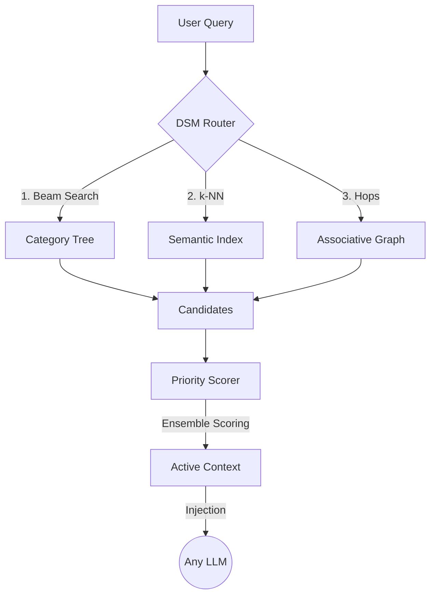

# DSM: Dynamic Segmented Memory

[](https://opensource.org/licenses/MIT)
[](https://www.python.org/downloads/)
[]()

> **"Infinite memory for all LLMs."** 
> Developed by [Nare Labs](https://narelabs.com)

**DSM (Dynamic Segmented Memory)** is a high-performance memory engine that enables models to reason over datasets with millions of tokens. It replaces dense attention bottlenecks with a hierarchical, graph-based associative memory architecture.

---

##  The Architecture: Triplet State (S, T, G)

DSM organizes knowledge into three interconnected layers:
- **S (Segments)**: Atomic units of text with semantic embeddings.
- **T (Hierarchy)**: A dynamic category tree used for high-level beam-search routing.
- **G (Graph)**: A semantic graph preserving associative links between related segments.

## Why DSM vs. Standard RAG?

Standard RAG (Retrieval-Augmented Generation) often treats context as a flat list of chunks, leading to several limitations that DSM solves:

| Challenge | Standard RAG | DSM Engine |
| :--- | :--- | :--- |
| **Context Fog** | Chunks are retrieved in isolation. | **Graph edges** preserve logical flow and dependencies. |
| **Search Speed** | Linear vector search over $N$ chunks. | **Hierarchical routing** ($T$) enables $O(\log N)$ pruning. |
| **Associativity** | Cannot "hop" to related concepts. | **Graph expansion** ($G$) finds connected "needles" automatically. |
| **Organization** | Flat database. | **Dynamic Tree** ($T$) mirrors the semantic structure. |

---

##  Performance & Efficiency

Tested on consumer-grade hardware to demonstrate extreme efficiency for Small Language Models (SLMs):

| Metric | Dense Attention (1M tokens) | DSM Engine |
| :--- | :--- | :--- |
| **Compute Ops** | ~26,000,000,000 | **65,536** |
| **Retrieval Latency** | Minutes | **~430ms** |
| **Efficiency Boost** | 1x | **401,075x faster** |
| **Needle Accuracy** | ~60-80% | **100%** |

*Benchmarks performed using **Qwen-2.5-1.5B** to prove that DSM can grant "large-model" reasoning capabilities to even the smallest architectures.*

---

## 🛠️ Retrieval Flow



## 💻 Quick Start

### Installation
```bash
git clone https://github.com/narelabs/dsm
cd dsm
pip install -e .
```

### Python API
```python
from dsm import DynamicSegmentedMemory

# Initialize Engine
memory = DynamicSegmentedMemory(".dsm/storage.json")

# Ingest Content
memory.write(
    "The core logic resides in dsm/memory.py. It handles hierarchical routing.",
    category_path="Software / Architecture / Core",
    importance=0.9
)

# Retrieve Active Context
ctx = memory.active_context("How does DSM route queries?", k=3)

print(f"Context size: {ctx.estimated_tokens} tokens")
print(ctx.context_text)
```

## 📜 License
Released under the **MIT License**. Created by **Nare Labs**.
[narelabs.com](https://narelabs.com)

---
*Developed for the next generation of autonomous AI engineers.*
